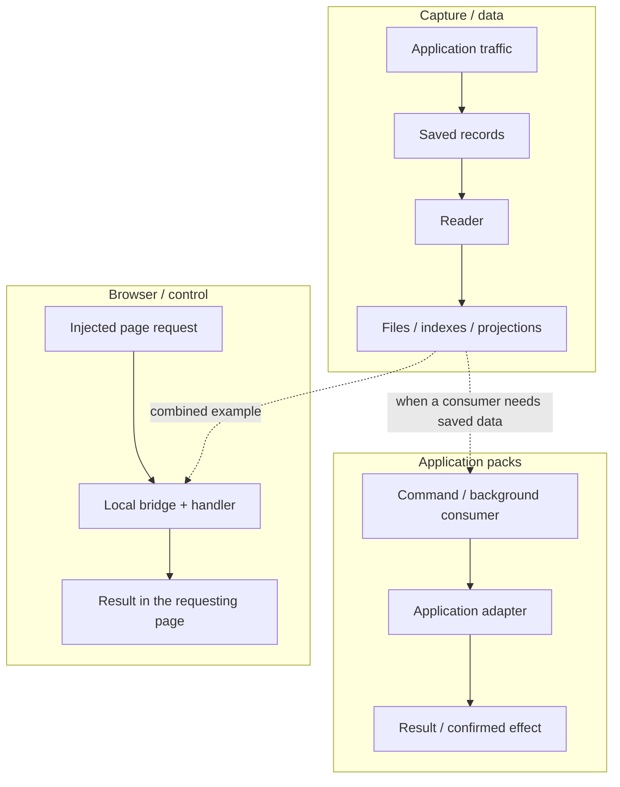
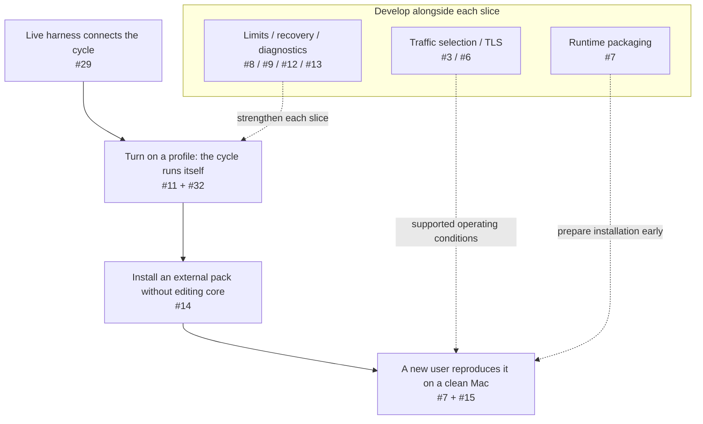

# TAP Core

Open infrastructure for observing and extending the exchange between local applications and the network.

## How it fits together

TAP supports three useful paths. This is the intended extension surface; the
implementation status below distinguishes what has been demonstrated so far.

Readers can run without a browser. Page interaction can run without saving traffic
or running readers; injection still needs page interception. Application commands
need not use either path. The open example combines capture and browser interaction.
The diagram shows successful paths; errors and uncertain effects need explicit
outcomes too. Application-specific behavior belongs in packs.

## Current implementation

TAP Core is being extracted from an existing working TAP installation. A first
[development-checkout runtime](docs/runtime.md) provides isolated macOS profiles
with the existing `install`, `on`, `off`, `status`, `doctor` and `where` command
surface. This is not yet a packaged clean-Mac release.
[Capture record v1 and journal positions](docs/capture-records.md) define the
current storage input for independent readers, including legacy compatibility
and explicit errors when retention removes a saved position.
[Independent reader runs](docs/readers.md) add per-reader progress, resume and
explicit replay over retained capture, with synthetic subprocess examples.

[The first live vertical slice](docs/live-slice.md) connects captured data to a
reader projection and an injected browser page through the existing WS bridge.

[Profile-owned injection and local routes](docs/profile-bridge.md) replace the
first live slice’s temporary injector configuration with explicit profile policy.

[Managed components](docs/managed-components.md) let the same profile lifecycle
start a generic Hub, schedule readers and return declared handler results to the
requesting page, using explicit development bindings.

## Scope

- Traffic capture and explicit routing policies by host, transport and source application.
- Local records, body storage and repeatable processing by independent readers.
- Response mutators, injected page code and a same-origin WebSocket bridge to local tools.
- Pack installation, lifecycle, configuration, compatibility checks and diagnostics.
- Installation, update, recovery and removal on supported macOS configurations.

Application-specific readers, UI changes and workflows belong in packs. Packs may be community-maintained or commercial. The core must support third-party packs without a vendor account or payment service.

## First release

A person on a clean supported Mac can install TAP Core, enable an open example pack, capture a controlled request, process its saved record, inject a page script and complete a page-to-local round trip. The same installation must survive restart and update, explain failures and restore the previous network configuration on removal.

Support for source-application attribution and routing must be established experimentally. A process label alone is not evidence that per-application routing works. Supported and unsupported configurations will be documented before release.

We will port and verify existing mechanisms incrementally. A general workflow engine, marketplace, billing service and application-specific features are outside this first core release.

The route to that release follows useful capabilities. Arrows show progression,
not a requirement to finish every linked issue before starting the next slice.
These are acceptance targets, not completion markers.

See the [release tracker](https://github.com/inem/tap-core/issues/1) for current
status and the [development views](docs/development-views.md) for the full diagrams,
including infrastructure responsibilities. Module, process, pack and repository
boundaries are separate decisions.

## Development

Issues contain the scope, acceptance criteria and dependencies for each slice. Follow the release tracking issue and milestones. A slice is complete when its user-visible behavior is demonstrated, not only when its files have been moved.

The [initial extraction proposal](docs/extraction-start.md) records observed
couplings, proposed distribution boundaries and a reproducible characterization
harness for the trusted legacy source. The [release tracker](https://github.com/inem/tap-core/issues/1)
links the implementation work. The legacy directory structure is not the target
architecture by default.

Read [TECHNOLOGY.md](TECHNOLOGY.md) for release requirements, working stack choices
and unresolved packaging decisions before starting an implementation task.
Use the [review lenses](docs/review-planes.md) to check the affected responsibility,
state, access and delivery boundaries and the evidence behind each claim.
The [development views](docs/development-views.md) show useful cycles, their
operating conditions and the route from a live harness to an installable product.

## License

The new scaffold in this repository is MIT licensed. Existing implementation files and bundled dependencies must pass the migration and license review before being added.
