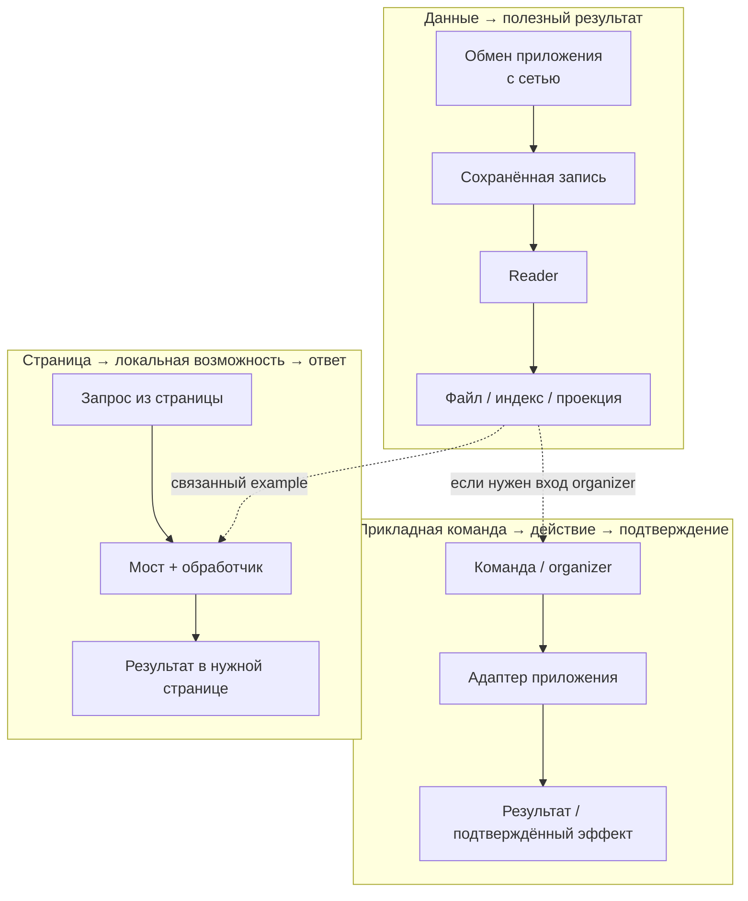
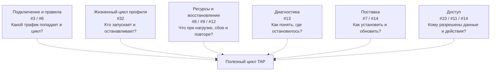
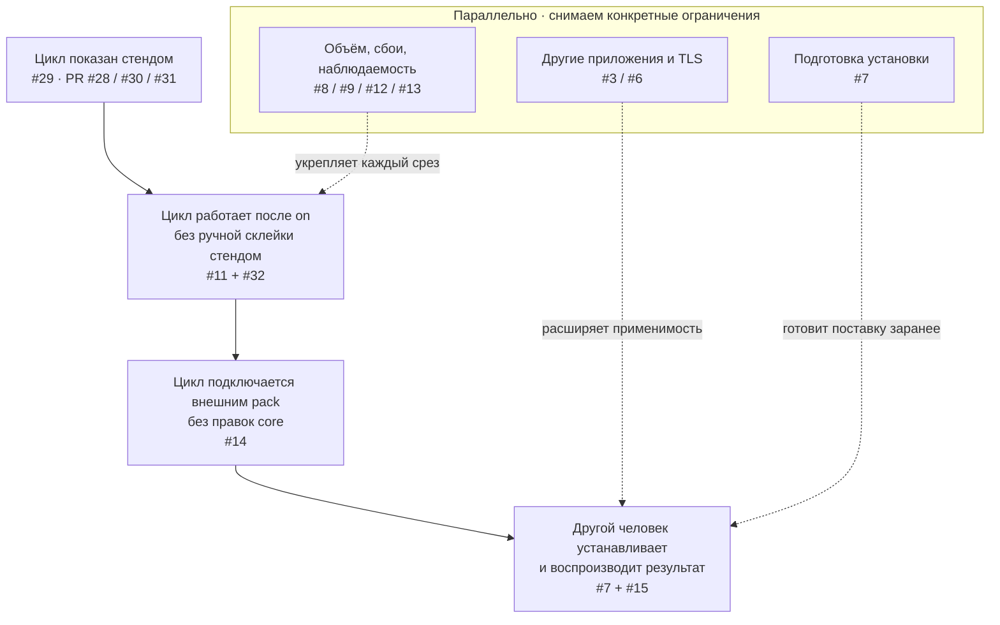

# Полезные циклы, инфраструктура и маршрут разработки

Три вида дополняют [граф зависимостей M1](https://github.com/inem/tap-core/milestone/2): что полезного делает TAP, что обеспечивает работу и какую возможность развиваем следующей. [Трекер #1](https://github.com/inem/tap-core/issues/1) содержит текущие статусы и критерии; схемы не заменяют их и не подтверждают завершение задач.

Сущностное развитие меняет доступный полезный цикл. Инфраструктурное развитие снимает ограничения его работы. **Это разрез изменений, а не постоянная классификация компонентов или тикетов.** Например, #32 управляет процессами и одновременно превращает ручной эксперимент в самостоятельно работающий цикл.

Один тикет или PR может появляться в нескольких видах: каждый раз показан конкретный аспект изменения. Например, [#9](https://github.com/inem/tap-core/issues/9) обеспечивает независимую доставку сохранённых записей reader в полезном цикле вида 1 и отвечает за checkpoint, resume/replay и наблюдаемый отказ в виде 2. Прикладная логика самого reader остаётся в pack. Повторение тикета связывает возможность с условиями её работы; виды не образуют взаимоисключающие слои.

## 1. Полезные циклы

У TAP несколько самостоятельных сценариев. Связанный example соединяет первые два; отдельный pack не обязан использовать все ветки. Команды могут обращаться к адаптеру без каталога или WS, а organizer может потреблять результаты readers.

Показаны успешные пути. Ошибки и неопределённый внешний эффект требуют отдельного наблюдаемого результата; схема не обещает подтверждение каждого вызова. Browser/control путь может работать без сохранения capture-записей и readers, но инжект всё ещё требует подключения страницы через поддерживаемый механизм перехвата.

## 2. Условия работы циклов

Инфраструктура развивается под конкретный сценарий. Не все перечисленные механизмы обязательны для первого эксперимента; обязательства выпуска остаются в критериях задач. Пунктир здесь означает обеспечение условий работы, а не очередь реализации.

## 3. Маршрут по появляющимся возможностям

Это порядок результатов первого открытого выпуска, а не требование ждать полного закрытия каждой задачи перед началом следующей. Подготовка установки, проверки отказов и диагностика идут вместе со срезами. App-routing из #3 не блокирует эксперимент с явным подключением клиента к proxy; решение о поддерживаемом app-scope выпуска остаётся обязательным.

Для выбора следующего среза ответить на два вопроса:

- Какой полезный цикл меняется?
- Какое ограничение его работы снимаем?

Для проверки самого изменения использовать [ракурсы ревью](review-planes.md). Модуль, процесс, pack и репозиторий остаются разными решениями; ни одна из схем не фиксирует их количество или границы поставки.
